# CEKG
A Tool for Constructing Event Graphs of the Care Pathways of Multi-Morbid Patients.

# 1-The Tool Address
First, go to [CEKG_Web](https://cekg-db1cc0d27386.herokuapp.com/) to see the first page of the tool.

# 2-The Home Page
Click on “START CEKG” to begin using the app.

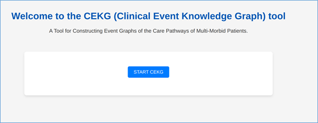

# 3-Login Page
The username and password for the demo program committee are in the Appendix of the paper.

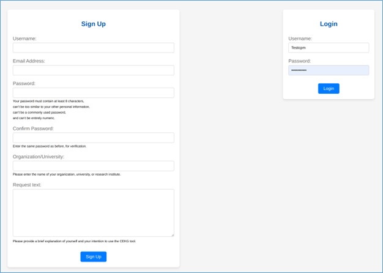

# 4-The Profile Page
On the next page, you can see the directory and output of the files you have created using the app. These files will be shown if you have previously used the app. Whether it's your first time using the app or you've used it before, you can click on "START CEKG" to begin building a new CEKG with the app.

# 5-The Care pathways options
On the next page, you need to select the type of care pathway you want to create.

## Step1) Select the type of care pathway you want to create.

## Step2) Other Configuration of the care pathways

### If you select the first or second option from Step 1, you will have 8 options to choose from regarding the details about activities you want to include in the care pathways.
### If you select the third, fourth, or fifth option from Step 1, you will have 12 options to choose from regarding the details about activities you want to include in the care pathways.

### If you select the sixth option from Step 1, you will have 2 options to decide whether you prefer to show only one of the following: Admission Disorders, Admission Treated Disorders, Admission Not Treated Disorders, or Admission New Disorders, or to display all of them together.

## Step3) Entities Configuration

### If you select the first, second, third, fourth, or fifth option from Step 1, you will have 9 options to choose from for the entities to be included in the care pathways.

### If you select the sixth option from Step 1, you will have 1 option for selecting the entities to be included in the care pathways.

## Step4) Activity Label

### If you select the first, second, third, fourth, or fifth option from Step 1, you will have 3 options for the activity labels to be included in the care pathways

### If you select the sixth option from Step 1, you will have 1 option for the activity label to be included in the care pathway.

# 6-Uploading the Dataset

Download the Test Dataset
The test dataset is provided as an Excel file (.xlsx). You can download it from this link: [DataSet](https://cekg-db1cc0d27386.herokuapp.com/](https://docs.google.com/spreadsheets/d/18PDQisLKwPPh6Gl7v5bCzYzUsiKmIGs_WYOzksPh5eM/edit?usp=sharing )

About the Test Dataset
The test dataset consists of several tabs within the Excel file. These tabs could also be individual CSV files, but to simplify the testing process, all the CSV files have been combined as tabs in a single Excel workbook. The names of the tabs can be customized as needed. These tabs are essential for creating the Clinical Event Knowledge Graph as presented in the paper [Clinical Event Knowledge Graphs: Enriching Healthcare Event Data with Entities and Clinical Concepts-Research Paper](https://link.springer.com/chapter/10.1007/978-3-031-56107-8_23)
You can also use your own dataset by considering this Excel file as a template.
Here, we will discuss what each tab in the workbook represents.

## Event Log Tab

This tab consists of our event log, which can be either a single-entity or multi-entity event log. Entities represent distinct existences. Sometimes, the terms “case notion,” “case,” “object,” and “dimensional” are used interchangeably. The term "multi-entity event log" is sometimes considered equivalent to “object-centric event log” or “multi-dimensional event log.” In the multi-entity event log definition, each entity is defined with its origin and IDs. The tab contains several columns:

- **Event_ID:** Contains the ID of each event.
- **Timestamp:** Contains the time and date of activities.
- **Activity:** Consists of the activity label of the event.
- **Activity_Synonym:** Contains abbreviations of activity labels. For example, BGT for Blood Gas Test.
- **Activity_Attributes_ID:** A unique foreign key ID for each distinct feature and value. For example:
  - `po2=295 → Activity_Properties_ID=1`
  - `lactate=3.23 → Activity_Properties_ID=2`
  - `Blood pressure=137/79 → Activity_Properties_ID=3`
  - `po2=412 → Activity_Properties_ID=4` (same feature but different value, so a different ID)
  - `lactate=0.73 → Activity_Properties_ID=5` (same feature but different value, so a different ID)
  - `po2=295 → Activity_Properties_ID=1` (same feature and same value, so the same ID)
  - `lactate=3.23 → Activity_Properties_ID=2` (same feature and same value, so the same ID)
- **Activity_Instance_ID:** A unique foreign key identifier for each distinct activity, considering its features and values. For example:
  - First event: `Blood Gas Test: po2=295, lactate=3.23 → Activity_Value_ID=1`
  - Second event: `BP_measurement: Blood pressure=137/79 → Activity_Value_ID=2` (different activity from the first event)
  - Third event: `Blood Gas Test: po2=412, lactate=0.73 → Activity_Value_ID=3` (same activity as the first event but with different feature values)
  - Fourth event: `Blood Gas Test: po2=295, lactate=3.23 → Activity_Value_ID=1` (same activity as the first event with the same feature values)
- **Entity1_origin** and **Entity1_ID:** Contain the origin and ID of each instance of the first entity. For example, the first entity instances could be “Patient1,” “Patient2,” etc.
- **Entity2_origin** and **Entity2_ID:** Contain the origin and ID of each instance of the second entity. For example, the second entity instances could be “Admission11,” “Admission12,” etc.

## EntitiesAttributes

This Excel tab contains the attributes of our entities. Each entity can have several attributes, which can either be used as entities themselves or only as attributes.

For example, age, gender, and admission are attributes of the Patient entity, as each patient has an age, gender, and admission sequence. Additionally, multimorbidity, treated multimorbidity, untreated multimorbidity, and new multimorbidity are attributes of the Admission entity. Similarly, each disorder is an attribute of multimorbidity, treated multimorbidity, untreated multimorbidity, and new multimorbidity.

- **Origin:** This column shows the type of attribute.
- **ID:** This column shows the ID of the attribute.
- **Name:** This column contains a mix of synonyms for origins and IDs.
- **Value:** This column contains the value of the attribute, if it exists.
- **Category:** This column has the value "absolute" for all attributes that are only used for data analysis.

## EntitiesAttributeRel

This Excel sheet shows the relationship between entities and their attributes.

- **Origin1:** This column contains the origin of the first entity or entity attribute.
- **ID1:** This column contains the ID of the first entity or entity attribute.
- **Origin2:** This column contains the origin of the second entity or entity attribute.
- **ID2:** This column contains the ID of the second entity or entity attribute.

## ActivityAttributes

This sheet of the dataset shows the activity attributes.

- **Activity_Attributes_ID:** This column contains a foreign key that relates to the event log sheet.
- **Activity:** This column shows the activity, corresponding to the "Activity" column in the event log sheet.
- **Activity_Synonym:** This column shows the synonym for the activity, with a corresponding column of the same name in the event log sheet.
- **Attribute:** This column contains the attributes.
- **Attribute_Value:** This column contains the values of the attributes.

## ActivitiesDomain

This sheet contains the domain of activities, which consists of only one column.

## ICD

This sheet of our dataset contains an excerpt of our ICD codes.

- **ICD_Origin:** This column contains values for all ICD entries. It is an auxiliary column used solely for data analysis.
- **ICD_Code:** This column shows the ICD codes.
- **ICD_Version:** This column shows the version of the ICD codes.
- **ICD_Code_Title:** This column shows the titles of the ICD codes.

## SCT_Node

This sheet of our dataset contains an excerpt of our SNOMED CT concept codes.

- **SCT_ID:** This column contains the SNOMED CT ID.
- **SCT_Code:** This column is an auxiliary column used in this sheet, not related to SNOMED CT terminology.
- **SCT_DescriptionA_Type1:** This column shows the description of SNOMED CT IDs with their semantic tag in parentheses.
- **SCT_DescriptionA_Type2:** This column shows the description of SNOMED CT IDs without their semantic tag in parentheses.
- **SCT_DescriptionB:** This column shows another description of SNOMED CT IDs, which exists only for some of them.
- **SCT_Semantic_Tags:** This column contains the semantic tags of SNOMED CT IDs.
- **SCT_Type:** This column contains the type of SNOMED CT, used to categorize SNOMED CT into three categories: root (only one ID, 138875005), top-level concept (we have 18 SNOMED CTs), and concept (all other IDs besides root and top-level concepts).
- **SCT_Level:** This is an index we used that shows the distance of a SNOMED CT ID from the root SNOMED CT ID (138875005). Sometimes, there are different paths to navigate from a SNOMED CT ID to the root SNOMED CT ID, so it may have more than one level. This index facilitates and enhances the speed of queries.

## SCT_REL

This sheet shows the relationships between SNOMED CT concepts.

- **SCT_ID_1:** The ID of the first SNOMED CT concept node.
- **SCT_Code_1:** The code of the first SNOMED CT concept node.
- **SCT_ID_2:** The ID of the second SNOMED CT concept node.
- **SCT_Code_2:** The code of the second SNOMED CT concept node.

## DK3

This sheet shows the constrained node mappings derived from the MIMIC-IV dataset, which relate each Disorder_ID (an attribute of multimorbidity) to each ICD code.

- **Disorder_ID:** This column shows the disorder attribute identifier.
- **ICD_Code:** This column contains the ICD code.

## DK4

This sheet shows the constrained node mappings derived from "OHDSI Athena" for relating ICD codes to SNOMED CT.

- **ICD_Code:** This column contains the ICD codes.
- **SCT_ID:** This column contains the SNOMED CT IDs.

## DK5

This sheet shows the constrained node mappings derived manually by searching to relate activities to SNOMED CT concepts.

- **Activity:** This column shows the activity, corresponding to the "Activity" column in the event log sheet.
- **Activity_Synonym:** This column shows the synonym for the activity, with a corresponding column of the same name in the event log sheet.
- **SCT_ID:** This column contains the SNOMED CT IDs.
- **SCT_Code:** This column contains the SNOMED CT codes.

## DK6_1

This sheet shows the constrained node mappings derived manually by searching to relate activities to domains.

- **Activity:** This column shows the activity, corresponding to the "Activity" column in the event log sheet.
- **Activity_Synonym:** This column shows the synonym for the activity, with a corresponding column of the same name in the event log sheet.
- **Activity_Domain:** This column shows the domain of activities.

## DK6_2

This sheet shows the constrained node mappings derived manually by searching to relate the domain of activities to SNOMED CT concepts.

- **Activity_Domain:** This column shows the domain of activities.
- **SCT_ID:** This column contains the SNOMED CT IDs.
- **SCT_Code:** This column contains the SNOMED CT codes.

## DK7

This sheet shows the constrained node mappings derived from training a supervised machine learning model to relate activity instance identifiers to disorder identifiers. By using this sheet, we can include another entity (disorder) in addition to the Patient and Admission entities in our analysis.

- **Activity_Instance_ID:** This column contains the activity instance identifiers. This foreign key can be related to the event log sheet.
- **Disorders_ID:** This column contains the identifiers of disorder attributes.

# 7-Neo4j Aura credentials
On this page, you are asked to enter your Neo4j Aura credentials. By inputting your Neo4j Aura credentials, we do not gain access to your Neo4j account; we simply send a query to it. Additionally, the reason we don’t provide a test account is that you wouldn’t be able to view the results in Neo4j Aura.

## Setting Up the Required Tools

Follow these steps to set up the tools required for this application:

1. Visit [Neo4j Aura](https://neo4j.com/cloud/platform/aura-graph-database/).
2. Click on **"Start Free."**
3. Sign up or log in.
4. Click on **"New Instance"** and select **"Try for Free."**
5. Save your username and password for future use.
6. Download and continue with the setup process.
7. Save the Connection URI for future use.

# 8-Selection the Excel Sheet
On this page, based on our selections for the care pathways option, we are asked to determine which sheet of our Excel file corresponds to which concepts. Additionally, a preview of our test Excel sheet is displayed on the page.

For the Test Dataset that was explained, the sheet sections are structured as follows:

- **Event Log:** `C_EventLog`
- **Entities Attributes:** `D_EntitiesAttributes`
- **The Relationship between Entries and their Attributes:** `D_EntitiesAttributeRel`
- **Activities Attributes:** `E_ActivityAttributes`
- **Activities Domain:** `F_ActivitiesDomain`
- **ICD:** `H_ICD`
- **SNOMED CT NODE:** `I_SCT_Node`
- **SNOMED CT Relationship:** `I_SCT_REL`
- **The Relationship between Disorder and ICD Code:** `L_DK3`
- **The Relationship between ICD Code and SNOMED CT ID:** `M_DK4`
- **The Relationship between Event Activities and SNOMED CT ID:** `N_DK5`
- **The Relationship between Event Activities and Activities Domain:** `O_DK6_1`
- **The Relationship between Activities Domain and SNOMED CT ID:** `O_DK6_2`
- **The Relationship between Events and Disorders:** `P_DK7`

On the subsequent pages, you will also be asked to select which columns of each sheet are related to specific concepts.

## Event Log Sheet Column Selection

On this page, you are first asked to select how many entities you have in your event log and then to select the columns related to each concept.

- **Number of Entities column:** 2
- **Event ID column:** `Event_ID`
- **Timestamp column:** `Timestamp`
- **Activity column:** `Activity`
- **Activity Synonym column:** `Activity_Synonym`
- **Activity Attributes ID column:** `Activity_Attributes_ID`
- **Activity Instance ID column:** `Activity_Instance_ID`
- **Entity 1 Origin column:** `Entity1_Origin`
- **Entity 1 ID column:** `Entity1_ID`
- **Entity 2 Origin column:** `Entity2_Origin`
- **Entity 2 ID column:** `Entity2_ID`

## Entities Attributes Sheet Column Selection

On this page, you are asked to select the columns related to each concept.

- **Entities Attributes Origin Column:** `Origin`
- **Entities Attributes ID Column:** `ID`
- **Entities Attributes Name Column:** `Name`
- **Entities Attributes Value Column:** `Value`
- **Entities Attributes Category Column:** `Category`

## Entities Attributes Relationship Sheet Column Selection

On this page, you are asked to select the columns related to each concept.

- **The First Entity Origin or the First Entity's Attribute Origin:** `Origin1`
- **The First Entity ID or the First Entity's Attribute ID:** `ID1`
- **The Second Entity Origin or the Second Entity's Attribute Origin:** `Origin2`
- **The Second Entity ID or the Second Entity's Attribute ID:** `ID2`

## Activities Attributes Sheet Column Selection

On this page, you are asked to select the columns related to each concept.

- **Activity Attributes ID:** `Activity_Attributes_ID`
- **Activity:** `Activity`
- **Activity Synonym:** `Activity_Synonym`
- **Activity Attributes:** `Attribute`
- **Activity Attributes Value:** `Activity_Attributes_ID`

## Activities Domain Sheet Column Selection

On this page, you are asked to select the columns related to each concept.

- **Activity Domains:** `Activity_Domain`

## ICD Sheet Column Selection

On this page, you are asked to select the columns related to each concept.

- **ICD Code Origin:** `icd_Origin`
- **ICD Code:** `icd_code`
- **ICD Code Version:** `icd_version`
- **ICD Code Title:** `icd_code_title`

## SNOMED CT NODE Sheet Column Selection

On this page, you are asked to select the columns related to each concept.

- **SNOMED CT ID:** `SCT_ID`
- **SNOMED CT Code:** `SCT_Code`
- **SNOMED CT Description A:** `SCT_DescriptionA_Type2`
- **SNOMED CT Description B:** `SCT_DescriptionB`
- **SNOMED CT Semantic Tags:** `SCT_Semantic_Tags`
- **SNOMED CT Concept Type:** `SCT_Type`
- **SNOMED CT Level:** `SCT_Level`

## SNOMED CT Relationship Sheet Column Selection

On this page, you are asked to select the columns related to each concept.

- **First SNOMED CT ID:** `sct_id_1`
- **First SNOMED CT Code:** `sct_code_1`
- **Second SNOMED CT ID:** `sct_id_2`
- **Second SNOMED CT Code:** `sct_code_2`

## The Relationship between Disorder and ICD Code Sheet Column Selection

On this page, you are asked to select the columns related to each concept.

- **Disorder ID:** `Disorders_ID`
- **ICD Code:** `icd_code`

## The Relationship between ICD Code and SNOMED CT ID Sheet Column Selection

On this page, you are asked to select the columns related to each concept.

- **ICD Code:** `icd_code`
- **SNOMED CT ID:** `SCT_ID`

## The Relationship between Event Activities and SNOMED CT ID Sheet Column Selection

On this page, you are asked to select the columns related to each concept.

- **Activity:** `Activity`
- **Activity Synonym:** `Activity_Synonym`
- **SNOMED CT ID:** `SCT_ID`
- **SNOMED CT Code:** `SCT_Code`

## The Relationship between Event Activities and Activities Domain Sheet Column Selection

On this page, you are asked to select the columns related to each concept.

- **Activity:** `Activity`
- **Activity Synonym:** `Activity_Synonym`
- **Activity Domain:** `Activity`

## The Relationship between Activities Domain and SNOMED CT ID Sheet Column Selection

On this page, you are asked to select the columns related to each concept.

- **Activity Domain:** `Activity_Domain`
- **SNOMED CT ID:** `SCT_ID`
- **SNOMED CT Code:** `SCT_Code`

## The Relationship between Events and Disorders Sheet Column Selection

On this page, you are asked to select the columns related to each concept.

- **Activity Instance ID:** `Activity_Instance_ID`
- **Disorder Entity ID:** `Disorders_ID`

# Building the Clinical Event Knowledge Graph

For building the clinical event knowledge graph, different steps—one for each sheet of the Excel file—were defined in a tool, with each step having two pages:

1. **Run Page:** This page includes a “Run” button for creating the graph or establishing relationships between two graphs using Neo4j queries. After running the process, you can click on the “Result” button to go to the result page.
2. **Result Page:** This page displays the Neo4j queries used during the process. To create the graph or establish relationships, several Neo4j queries need to be executed step by step. Some of these queries are used to clear the database, remove or create constraints, create or modify nodes, or create relationships between nodes. This page also shows the generated nodes and the relationships between them. Since the tool sends the queries to the Neo4j Aura Database, you can open your database in the Neo4j Aura account to view the created nodes and relationships. The queries are also saved in a text file on the tool’s profile page, allowing you to create an empty database in Neo4j Aura and run these queries one by one to recreate the graph or establish relationships between two graphs.

## Creating a Labeled Property Graph for the Event Log

By clicking the “Run” button, the Event Log sheet is converted into an Event Log graph.

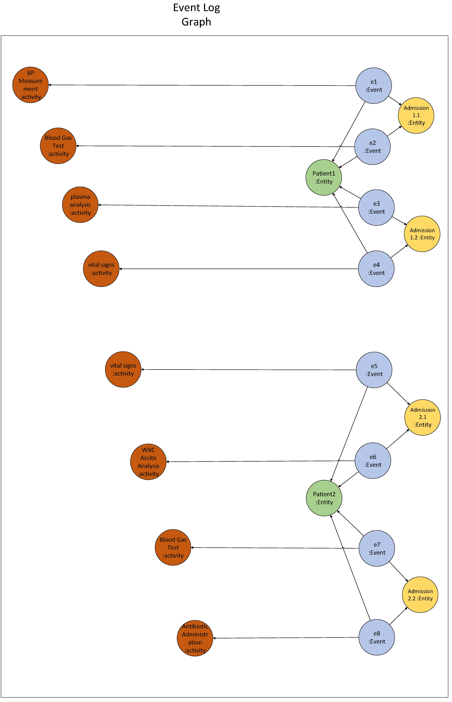

The queries executed step by step are as follows:

- Clearing the Database
- Clearing the Constraints
- Creating the Constraints for the Event Log's LPG
- Clearing a Node for the Event Log
- Creating Nodes for Each Event
- Creating Nodes for Each Entity Instance
- Creating Nodes for Each Activity Instance
- Creating Nodes for Each Activity Attribute ID Instance
- Linking the Event Log Node to the Event Nodes with a 'HAS' Relationship
- Linking the Event Nodes to the Entity Nodes with a 'CORR' Relationship
- Linking the Event Nodes to the Activity Nodes with an 'OBSERVED' Relationship
- Linking the Event Nodes to the Activity Properties Nodes with a 'MONITORED' Relationship

## Creating a Labeled Property Graph for Entities Attributes

By clicking the “Run” button, a node will be created for each row in the Entities Attributes sheet of the Excel file:

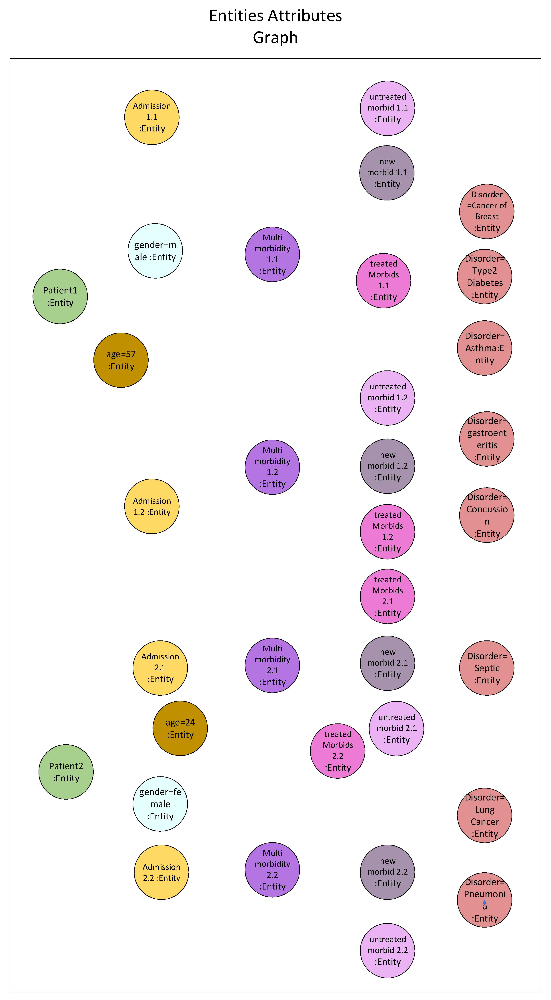

The queries executed step by step are as follows:

- Clearing the Database Except for the Previously Created Ones
- Clearing the Constraints Except for the Previously Created Ones
- Creating the Constraints for the Entities Attributes' LPG
- Creating Nodes for Each of the Entities Attributes' Instances

## Creating Relationships Between Entities and Entities Attributes

By clicking the “Run” button, the Entities Attributes graph is created by establishing relationships between the entities attributes nodes, using the data from the Entities Attributes sheet in the Excel file.

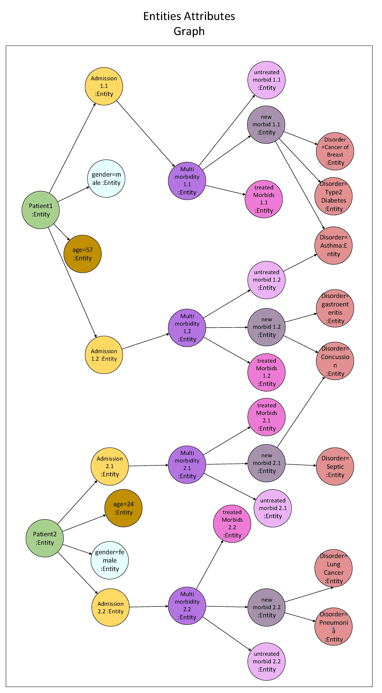

The queries executed step by step are as follows:

- Clearing the database except for the previously created ones
- Clearing the constraints except for the previously created ones
- Creating the relationship between different entities attributes named 'INCLUDED'
- Clearing the database except for the previously created ones
- Clearing the constraints except for the previously created ones
- Linking the admission treated disorders nodes to the disorders nodes with a relationship named 'INCLUDED'
- Linking the admission untreated disorders nodes to the disorders nodes with a relationship named 'INCLUDED'
- Linking the admission new disorders nodes to the disorders nodes with a relationship named 'INCLUDED'
- Adding a property to the 'Multimorbidity' node to store the disorders named 'Value'
- Adding a property to the 'Admission Treated Disorders' node to store the disorders named 'Value'
- Adding a property to the 'Admission Untreated Disorders' node to store the disorders named 'Value'
- Adding a property to the 'Admission New Disorders' node to store the disorders named 'Value'

## Creating a Labeled Property Graph for Activity Attributes

By clicking the “Run” button, activity attributes are added to the Event Log graph. These activity attributes are sourced from the Activities Attributes sheet in the Excel file.

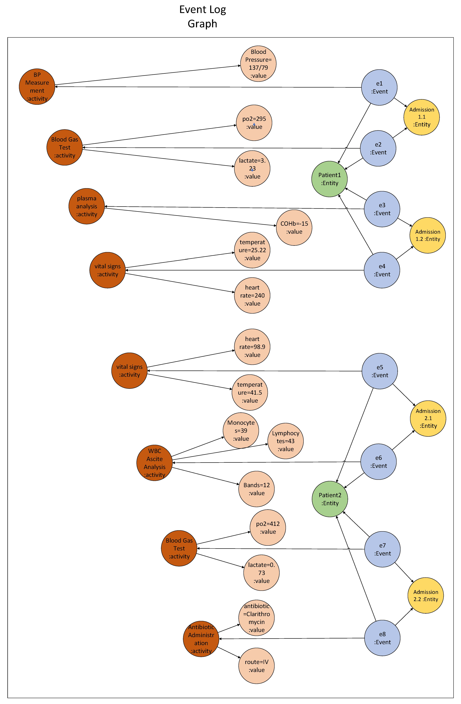

The queries executed step by step are as follows:

- Clearing the database except for the previously created ones
- Clearing the constraints except for the previously created ones
- Creating the constraints for the Activities Attributes’ LPG
- Creating nodes for each feature instance (Activity Attributes Labels and Values)
- Linking the Activity Attributes nodes to the feature nodes with a relationship named 'ASSIGN'

## Creating a Labeled Property Graph for Activities Domains

By clicking the “Run” button, a node is created for each row in the Activity Domain sheet of the Excel file.

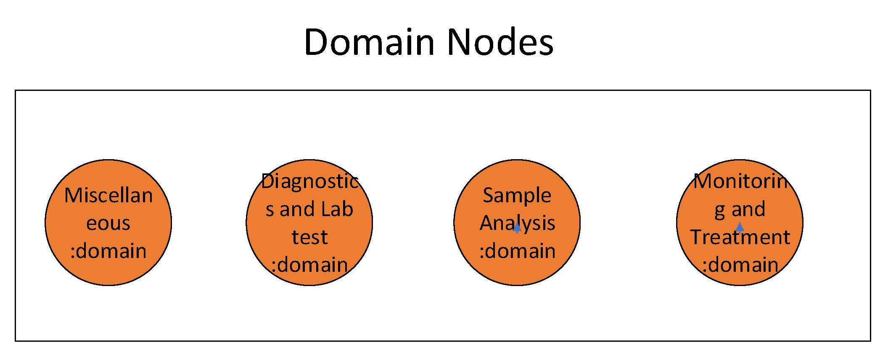

The queries executed step by step are as follows:

- Clearing the Database Except the Previously Created Ones
- Clearing the Constraints Except the Previously Created Ones
- Creating the Constraints for the Activities Domain's LPG
- Creating Nodes for Each Activities Domain Instance

## Creating a Labeled Property Graph for ICD Codes

By clicking the “Run” button, a node is created for each row in the ICD sheet of the Excel file.

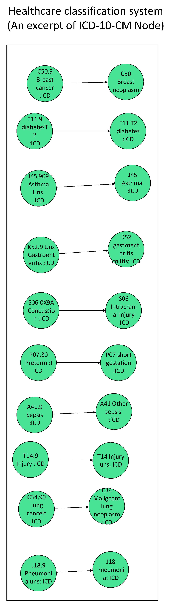

The queries executed step by step are as follows:

- Clearing the Database Except the Previously Created Ones
- Clearing the Constraints Except the Previously Created Ones
- Creating the Constraints for the ICD's LPG
- Creating Nodes for Each ICD Instance

## Creating Nodes for SNOMED-CT Concepts

By clicking the “Run” button, a node is created for each row in the SNOMED CT Node sheet of the Excel file.

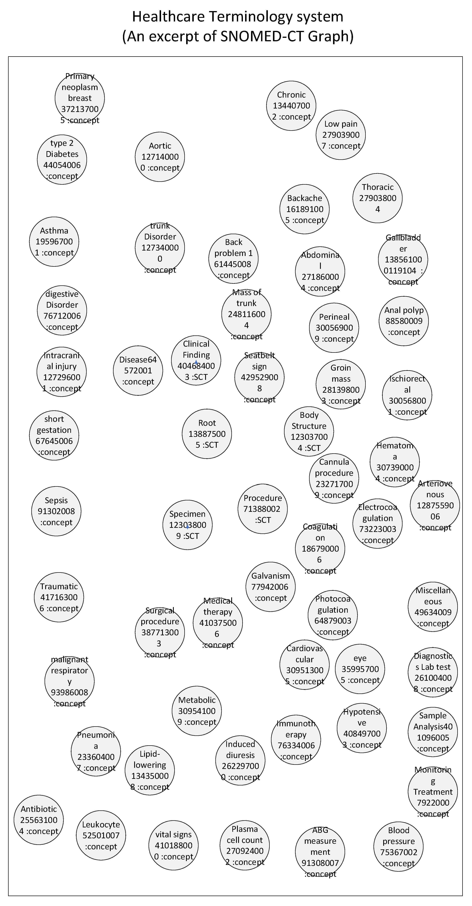

The queries executed step by step are as follows:

- Clearing the Database Except the Previously Created Ones
- Clearing the Constraints Except the Previously Created Ones
- Creating the Constraints for the SNOMED-CT's LPG
- Creating Nodes for Each SNOMED-CT Instance

## Creating Relationships Between Nodes of SNOMED-CT Concepts

By clicking the “Run” button, the SNOMED-CT graph is created by establishing relationships between the SNOMED CT nodes, using the data from the SNOMED CT Relationship sheet in the Excel file.

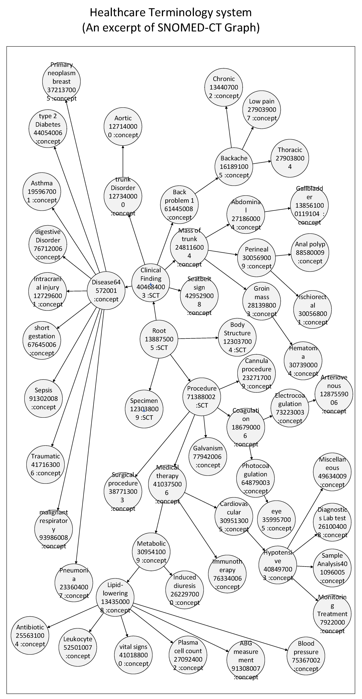

The queries executed step by step are as follows:

- Clearing the Database Except the Previously Created Ones
- Linking the SNOMED-CT Concepts Nodes Together with 'ANCESTOR_OF'
- Modifying the SNOMED-CT Concepts Nodes

## Connecting Diagnosed Disorders to ICD Codes

By clicking the “Run” button, the Disorder nodes in the Entities Attributes graph are connected to the ICD nodes using the data from the DK3 sheet in the Excel file.

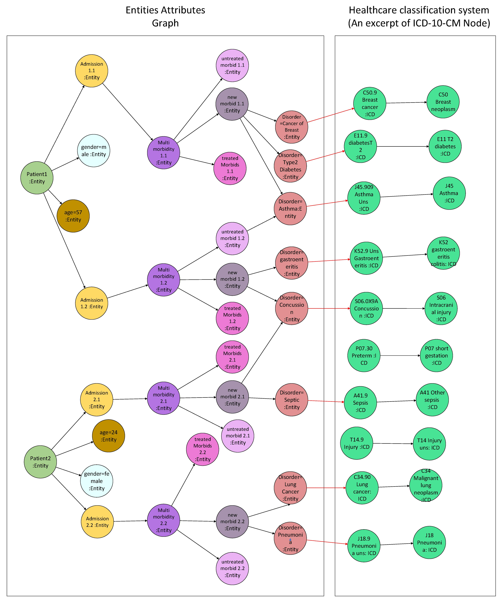

The queries executed step by step are as follows:

- Clearing the Database Except the Previously Created Ones
- Linking the Disorder Nodes to the ICD Nodes with a Relationship Named 'LINKED_TO'

## Connecting ICD Codes to SNOMED-CT ID

By clicking the “Run” button, the ICD Code graph is connected to the SNOMED-CT nodes using the data from the DK4 sheet in the Excel file.

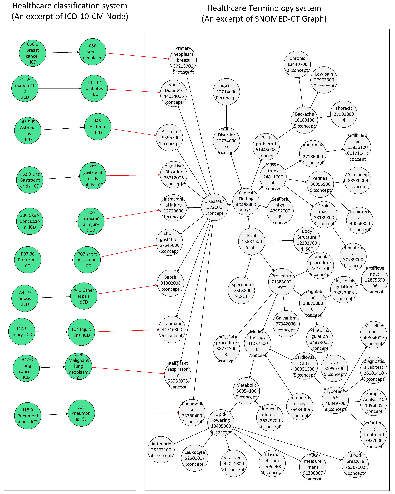

The queries executed step by step are as follows:

- Clearing the Database Except the Previously Created Ones
- Linking the ICD Nodes to the SNOMED-CT Nodes with a Relationship Named 'CONNECTED_TO'

## Connecting Activities to SNOMED-CT Codes

By clicking the “Run” button, the Activities nodes in the Event Log graph are connected to the SNOMED-CT nodes using the data from the DK5 sheet in the Excel file.

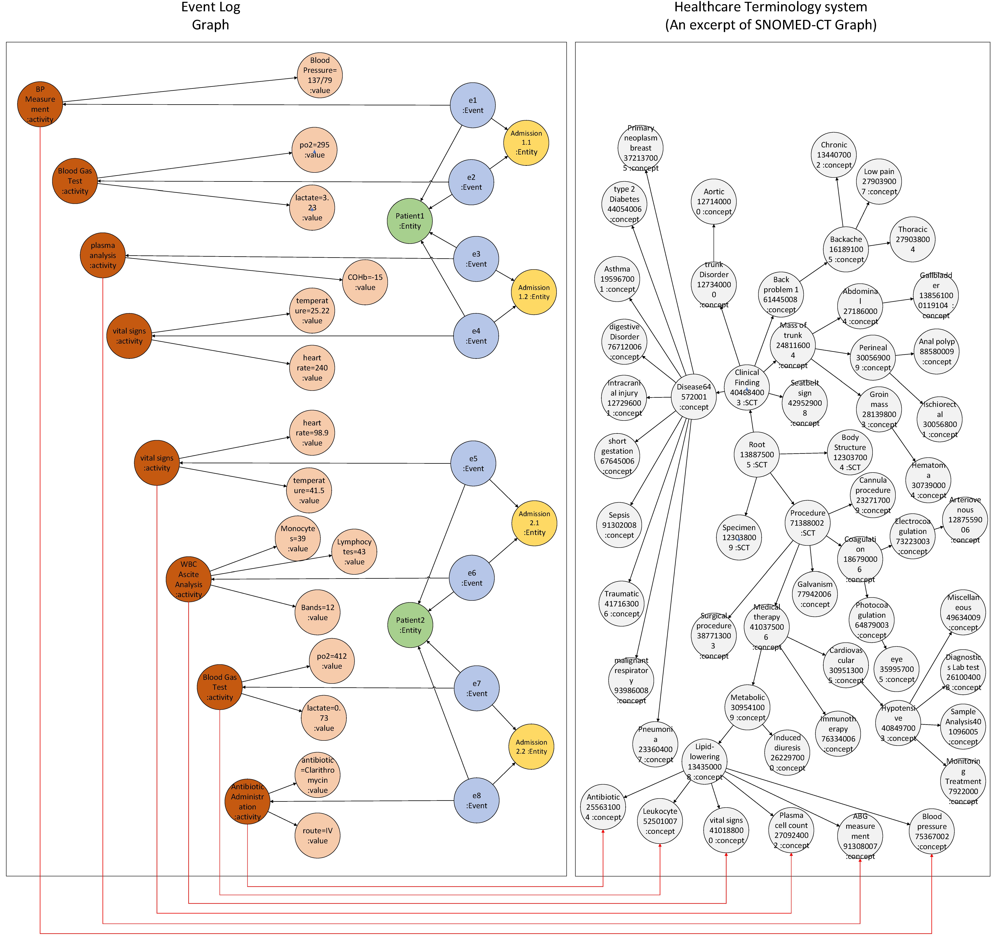

The queries executed step by step are as follows:

- Clearing the Database Except the Previously Created Ones
- Linking the Activity Nodes to the SNOMED-CT Nodes with a Relationship Named 'MAPPED_TO'
- Linking the Activity Properties Nodes to the SNOMED-CT Nodes with a Relationship Named 'MAPPED_TO'

## Connecting Activities to Domains and Connecting Domains to SNOMED-CT Codes

By clicking the “Run” button, the Activity Domains in the Event Log graph are connected to the SNOMED CT nodes using the data from the DK6_1 and DK6_2 sheets in the Excel file.

The queries executed step by step are as follows:

- Clearing the Database Except the Previously Created Ones
- Linking the Domain Nodes to the SNOMED-CT Nodes with a Relationship Named 'TIED'
- Queries for Linking the Activity Nodes to the Domain or SNOMED-CT Nodes with a Relationship Named 'TYPE_OF'
- Queries for Linking the Activity Properties Nodes to the Domain or SNOMED-CT Nodes with a Relationship Named 'TYPE_OF'

## Connecting Events to Disorders and Defining Diagnosed Disorders as New Entities

By clicking the “Run” button, the Event nodes in the Event Log graph are connected to the Disorder nodes in the Entities Attributes graph using the data from the DK7 sheet in the Excel file.

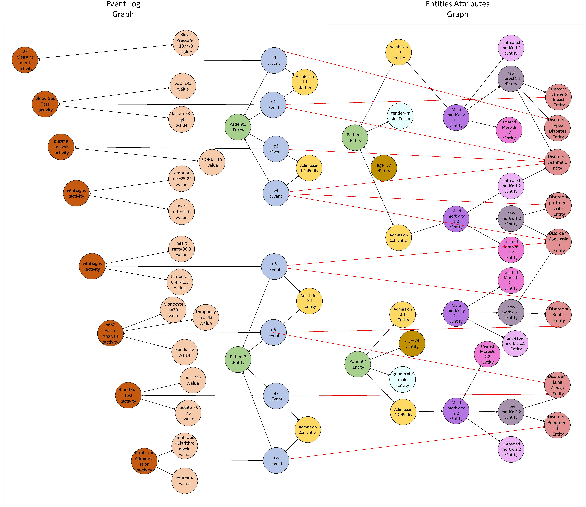

The queries executed step by step are as follows:

- Clearing the Database Except the Previously Created Ones
- Linking the Event Nodes to the SNOMED-CT Nodes with a Relationship Named 'CORR'

## Creating Directly Follows (DF) Relationships and Finalizing the Clinical Event Knowledge Graph

By clicking the “Run” button, the clinical event knowledge graph will be fully built by creating directly follow (DF) relationships between events, activities, and entities. The DF relationships will be established based on the options selected on the care pathway options pages.

- **If we select option 1 or 2:** The DF relationship is created between event nodes.
- **If we select option 3:** The DF relationship is created between activity nodes separately for each entity, but without considering the entity_ID (e.g., for all patients, activity a1 directly follows a2 fifty times).
- **If we select option 4:** The DF relationship is created between activity nodes separately for each entity while considering the entity_ID (e.g., for Patient 1, activity a1 directly follows a2 thirty times; for Patient 2, twenty times).
- **If we select option 5:** The DF relationship is created between activity nodes for one entity’s different IDs with respect to another entity’s non-reified IDs (e.g., for Patient 1, activity a1 directly follows a2 twenty-six times for Disorder 1).
- **If we select option 6:** The DF relationship is created between the entities (e.g., between patients, admissions, and disorders).
- 

The queries executed step by step are as follows:

- Clearing the Database Except the Previously Created Ones
- Modifying the Event Nodes
- Creating Nodes for Reified Entities
- Linking the Entity Nodes Together with a Relationship Named 'REL'
- Linking the Entity Nodes to the Reified Entity Nodes with a Relationship Named 'REL'
- Linking the Event Nodes to the Reified Entity Nodes with a Relationship Named 'CORR'
- Creating the Directly Follows Relationship, 'DF,' Between Events
- Removing the Polluted Directly Follows Relationships for Reified Entities
- Removing the Wrong Directly Follows Relationships for Reified Entities
- Removing the Reversed Directly Follows Relationships for Reified Entities
- Removing the Polluted CORR Relationships for Reified Entities
- Restoring CORR Relationships Wrongly Deleted in the Previous Step
- Removing Reified Entities and Their REL Relationships Where No DF Relationship Exists Based on Those Reified Entities
- Creating Directly Follows by Aggregating Different IDs of Each Entity (DF_C Absolute)
- Creating Directly Follows by Aggregating Different IDs of Each Entity Origin Based on Another Entity Origin (DF_C Relative)
- Creating Directly Follows by Aggregating Different Entity Origins (DF_C All)
- Creating Directly Follows Relationship Between Each Entity (DF_E One)
- Creating Directly Follows Relationship Between Different Origin Entities (DF_E Two)
- Creating the Directly Follows Relationship Based on Activity Properties, 'DF,' Between Events
- Creating Directly Follows Based on Activity Properties by Aggregating Different IDs of Each Entity (DF_C Absolute)
- Creating Directly Follows Based on Activity Properties by Aggregating Different IDs of Each Entity Origin Based on Another Entity Origin (DF_C Relative)
- Creating Directly Follows Based on Activity Properties by Aggregating Different Entity Origins (DF_C All)

## Discovering Care Pathways from the Clinical Event Knowledge Graph

Finally, by querying the Clinical Event Knowledge Graph, the care pathways are discovered.

