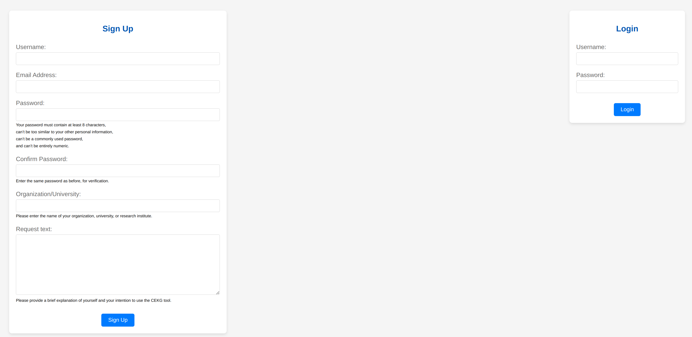
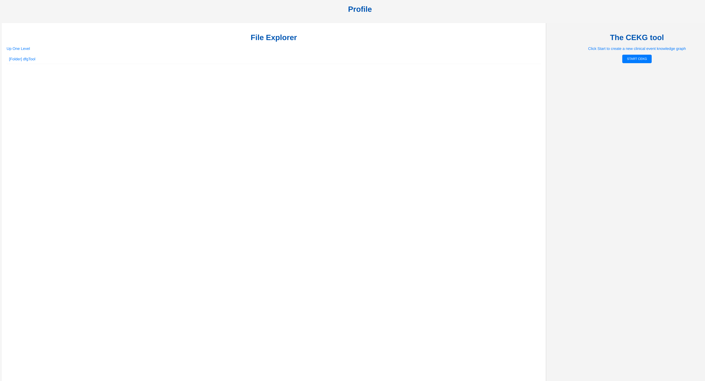

# CEKG
A Tool for Constructing Event Graphs of the Care Pathways of Multi-Morbid Patients.

# 1-The Tool Address
First, go to [CEKG_Web](https://cekg-db1cc0d27386.herokuapp.com/) to see the first page of the tool.

# 2-The Home Page
Click on “START CEKG” to begin using the app.

# 3-Login Page
The username and password for the demo program committee are in the Appendix of the paper.

# 4-The Profile Page
On the next page, you can see the directory and output of the files you have created using the app. These files will be shown if you have previously used the app. Whether it's your first time using the app or you've used it before, you can click on "START CEKG" to begin building a new CEKG with the app.

