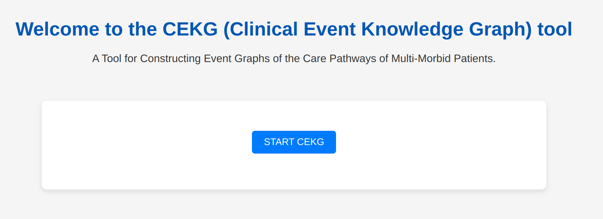

# CEKG
A Tool for Constructing Event Graphs of the Care Pathways of Multi-Morbid Patients.

# 1-The Tool Address
First, go to [CEKG_Web](https://cekg-db1cc0d27386.herokuapp.com/) to see the first page of the tool.

# 2-The Home Page
Click on “START CEKG” to begin using the app.

