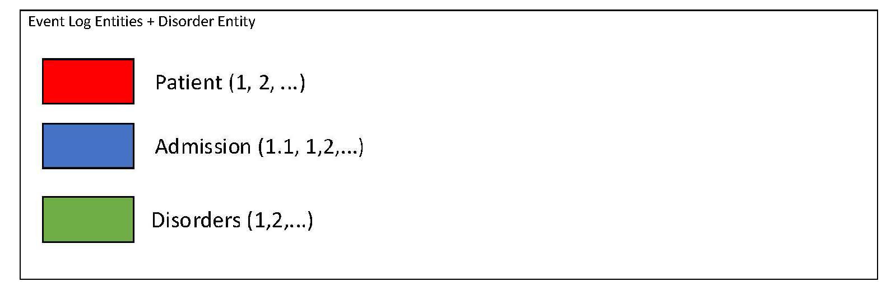
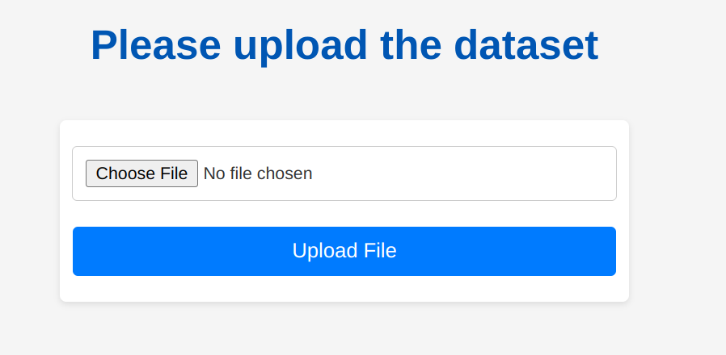

# CEKG
A Tool for Constructing Event Graphs of the Care Pathways of Multi-Morbid Patients.

# 1-The Tool Address
First, go to [CEKG_Web](https://cekg-db1cc0d27386.herokuapp.com/) to see the first page of the tool.

# 2-The Home Page
Click on “START CEKG” to begin using the app.

# 3-Login Page
The username and password for the demo program committee are in the Appendix of the paper.

# 4-The Profile Page
On the next page, you can see the directory and output of the files you have created using the app. These files will be shown if you have previously used the app. Whether it's your first time using the app or you've used it before, you can click on "START CEKG" to begin building a new CEKG with the app.

# 5-The Care pathways options
On the next page, you need to select the type of care pathway you want to create.

## Step1) Select the type of care pathway you want to create.

## Step2) Other Configuration of the care pathways

### If you select the first or second option from Step 1, you will have 8 options to choose from regarding the details about activities you want to include in the care pathways.

### If you select the third, fourth, or fifth option from Step 1, you will have 12 options to choose from regarding the details about activities you want to include in the care pathways.

### If you select the sixth option from Step 1, you will have 2 options to decide whether you prefer to show only one of the following: Admission Disorders, Admission Treated Disorders, Admission Not Treated Disorders, or Admission New Disorders, or to display all of them together.

## Step3) Entities Configuration

### If you select the first, second, third, fourth, or fifth option from Step 1, you will have 9 options to choose from for the entities to be included in the care pathways.

### If you select the sixth option from Step 1, you will have 1 option for selecting the entities to be included in the care pathways.

## Step4) Activity Label

### If you select the first, second, third, fourth, or fifth option from Step 1, you will have 3 options for the activity labels to be included in the care pathways

### If you select the sixth option from Step 1, you will have 1 option for the activity label to be included in the care pathway.

# 6-Uploading the Dataset

